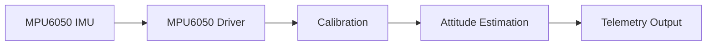

# Software Architecture

## Overview

This document describes the software architecture of the STM32 Nucleo-F446RE implementation of the MPU6050 attitude-estimation project.

The firmware is organized around STM32Cube-generated startup code, STM32 HAL peripheral drivers, and a modular application structure for the STM32F446RE. At a high level, the system repeatedly:

1. Reads raw accelerometer and gyroscope data from the MPU6050 over I2C
2. Applies calibration and unit conversion
3. Estimates roll and pitch
4. Sends telemetry over the configured serial interface

---

## Data Flow

Raw sensor data is read from the MPU6050 through the driver layer, corrected by the calibration layer, processed by the attitude-estimation layer, and then transmitted as telemetry. The complementary filter is treated as part of the attitude-estimation stage rather than as a separate software module.

---

## Software Layers

### HAL and Board Support

This layer contains STM32Cube-generated startup code and peripheral configuration for the Nucleo-F446RE, including clock setup, GPIO, I2C, UART, and interrupt support.

The HAL provides the MCU-facing interface used by the application, including peripheral handles and APIs for initialization, timing, communication, and data transfer.

### Sensor Driver

The MPU6050 driver handles register-level communication with the sensor.

Its responsibilities include:

- Waking the MPU6050
- Configuring device registers
- Reading accelerometer and gyroscope data
- Verifying communication through `WHO_AM_I`
- Hiding low-level I2C transactions from the rest of the code

Typical files:

- `Core/Inc/mpu6050.h`
- `Core/Src/mpu6050.c`

### Calibration

The calibration module removes startup bias and converts raw sensor values into physical units.

Its responsibilities include:

- Collecting stationary startup samples
- Computing accelerometer biases
- Computing gyroscope biases
- Correcting the gravity offset on the accelerometer Z-axis
- Converting accelerometer data to g
- Converting gyroscope data to degrees per second

Typical files:

- `Core/Inc/calibration.h`
- `Core/Src/calibration.c`

### Attitude Estimation

The attitude module computes roll and pitch from calibrated sensor data.

Its responsibilities include:

- Computing accelerometer-based roll and pitch
- Integrating gyroscope angular velocity over time
- Applying the complementary filter
- Maintaining filtered roll and pitch state

Typical files:

- `Core/Inc/attitude.h`
- `Core/Src/attitude.c`

### Main Application

The main application coordinates the full pipeline.

Its responsibilities include:

- Initializing the MCU and peripherals
- Starting and configuring the MPU6050
- Running calibration at startup
- Executing the fixed-rate loop
- Calling driver, calibration, and attitude functions
- Formatting and transmitting telemetry

Typical files:

- `Core/Src/main.c`
- `Core/Inc/main.h`

---

## Execution Flow

### Startup Sequence

A typical startup sequence is:

1. HAL and system initialization
2. Clock and peripheral configuration
3. MPU6050 initialization
4. Calibration
5. Initial attitude setup
6. Entry into the main loop

Each stage depends on the previous one, so sensor reads and estimation begin only after the board, peripherals, and calibration are ready.

### Main Loop

After startup, the firmware repeatedly:

1. Reads the current loop time
2. Acquires raw IMU data
3. Applies calibration and unit conversion
4. Computes accelerometer roll and pitch
5. Integrates gyroscope rates
6. Applies the complementary filter
7. Sends a telemetry line
8. Waits for the next sample period

This fixed pipeline keeps the sampling and estimation flow predictable.

---

## Timing

Timing is especially important for gyroscope integration, because the quality of the estimate depends directly on the loop interval.

In the STM32 environment, timing is typically managed using HAL-supported timing functions such as `HAL_GetTick()` or hardware timers, depending on the resolution required. This provides a cleaner path to consistent sampling and future expansion than an ad hoc polling loop.

---

## Telemetry

The final stage of the architecture is telemetry output.

After each estimation cycle, the firmware formats the current time, accelerometer estimate, gyroscope estimate, and filtered estimate into a compact CSV line and sends it over the configured serial interface. This keeps output separate from the sensing and estimation logic and makes the system easier to maintain.

---

## Module Summary

- **HAL / board layer**: configures the STM32 and its peripherals
- **MPU6050 driver**: communicates with the IMU over I2C
- **Calibration**: removes bias and converts to physical units
- **Attitude**: estimates roll and pitch and applies the complementary filter
- **Main application**: coordinates the loop and telemetry

---

## References

- [NUCLEO-F446RE Product Page — STMicroelectronics](https://www.st.com/en/evaluation-tools/nucleo-f446re.html)
- [STM32F446RE Product Page — STMicroelectronics](https://www.st.com/en/microcontrollers-microprocessors/stm32f446re.html)
- [UM1725 - Description of STM32F4 HAL and low-layer drivers — STMicroelectronics](https://www.st.com/resource/en/user_manual/um1725-description-of-stm32f4-hal-and-lowlayer-drivers-stmicroelectronics.pdf)
- [HAL I2C APIs — STMicroelectronics](https://dev.st.com/stm32cube-docs/stm32u5-hal2/2.0.0-beta.1.1/docs/drivers/hal_drivers/i2c/hal_i2c_apis.html)